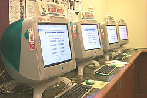

# chrome-kiosk
We have implemented multiple forms of kiosks throughout the years at the Marriott Library or other locations on campus that we support. Initially, we implemented web kiosks that provided anonymous users at the Marriott Library quick access to limited library & campus resources like the catalog system, databases, etc. These web kiosks needed to be secure, resilient, and easy to use for the public but at the same time prevent anonymous access to resources we do not allow. This expanded to “exhibit” kiosks that would include media content like audio, video and other types of content focused around a specific library exhibits.

And finally, we have implemented “Digital Displays” which use technologies such as LCD, LED and projection to display digital images, video, web pages, or text. They can be found in public spaces of the Marriott Library to provide wayfinding, exhibitions, and marketing & communication information including text, animated or video messages for advertising, information, entertainment, and merchandising to campus students, staff, and faculty.

For more detailed information about our Mac kiosk implementation, see our blog [post](https://apple.lib.utah.edu/managing-mac-kiosks/).

## Contents

- [chrome-kiosk](#chrome-kiosk)
  * [Download](#download)
  * [Contact](#contact)
  * [System Requirements](#system-requirements)
  * [Install](#install)
  * [Uninstall](#uninstall)
  * [History](#history)
    + [Apple Safari, Custom Scripts & Tools](#apple-safari--custom-scripts---tools)
    + [xStand](#xstand)
  * [Using Google Chrome for Kiosks](#using-google-chrome-for-kiosks)
    + [Script](#script)
    + [Configuration](#configuration)
    + [LaunchAgent](#launchagent)
    + [Miscellaneous](#miscellaneous)
      - [Metrics Reporting](#metrics-reporting)
  * [Quick Manual Setup](#quick-manual-setup)
    + [Test Kiosk Mac](#--test-kiosk-mac--)
    + [Download](#--download--)
    + [Script](#--script--)
      - [Copy Script](#copy-script)
      - [Change Owner/Group & Permissions](#change-owner-group---permissions)
    + [Configuration File](#--configuration-file--)
      - [Create Directory](#create-directory)
      - [Change Directory Owner/Group & Permissions](#change-directory-owner-group---permissions)
      - [Copy Configuration File](#copy-configuration-file)
      - [Change File Owner/Group & Permissions](#change-file-owner-group---permissions)
      - [Modify Default File Configurations](#modify-default-file-configurations)
    + [LaunchAgent](#--launchagent--)
      - [Copy LaunchAgent](#copy-launchagent)
    + [Test Kiosk Setup](#--test-kiosk-setup--)
      - [Load LaunchAgent](#load-launchagent)
      - [Unload LaunchAgent](#unload-launchagent)
        * [One Liner](#one-liner)
  * [Update History](#update-history)

## Download
Download the latest release here!

## Contact
If you have any comments, questions, or other input, either file an issue or send us an [email](mailto://mlib-its-mac-github@lists.utah.edu). Thanks!

## System Requirements
The chrome-kiosk repository has the following requirements.

* **Python** - The chrome-kiosk main script was written in python2 and hasn't been tested with python3, but might work properly.
* **macOS** - Requires macOS and has been tested with macOS 10.12.x thru macOS 10.14.x
* **Google Chrome** - Requires Google Chrome for macOS and tested with latest releases.

## Install
To use this project, you install the following items in the recommended locations:

* **Script** - We recommand installing in the location `/usr/local/bin/chrome_kiosk.py` and make sure its executable.
* **Configuration** - The default location for the configuration property list file is `/Library/Management/edu.utah.mlib.kiosk.settings.plist`
* **LaunchAgent** - The default location for the LaunchAgen list file is the "kiosk" user home folder `~/Library/LaunchAgents/edu.utah.mlib.kiosk.chrome.display.plist`

## Uninstall
If you followed the above recommendations, you can uninstall by removing the above items from the locations listed above.

* **Script** - `/usr/local/bin/chrome_kiosk.py`
* **Configuration** - `/Library/Management/edu.utah.mlib.kiosk.settings.plist`
* **LaunchAgent** - `/Users/[KIOSK USER]/Library/LaunchAgents/edu.utah.mlib.kiosk.chrome.display.plist`

## History

### Apple Safari, Custom Scripts & Tools
Starting around 2004, we implemented public web kiosks using Mac OS X. On a standard Mac OS X system, users have greater overall access to the operating system features. They can run the Finder, use the Dock, launch most applications, and save files in their home folder. On our public web kiosks, however, are significantly more “restrictive”, limiting users’ access to just a few applications. The available applications are confined to a small subset like a web browser, utilities, and helper applications. The kiosks themselves have been set up to be extremely easy to use, capable of operating relatively unattended, require minimal maintenance, and are easy to update. Their key operating feature is the ability to restrict users from making changes to the system or hard disk.



While this method was effective for many years, other backend code and configuration maintenance made supporting new operating system versions and Safari browser updates more and more difficult. And with increasing demands, projects & priorities on our IT group, it was decided to move to a commercial application called, xStand.

### xStand
xStand allowed us to restrict access to some web sites, the operating system, system settings, the downloading of files and applications with little additional development and free up our time from continually updating our previously internally developed public web kiosk scripts & configuration. It had a few minor issues and annoyances but overall worked well for our needs.

Unfortunately, after many years of solid service, the company supporting xStand closed its doors and sold the software to another developer, and then their license servers were decommissioned that prevented the software from running properly.

##  Using Google Chrome for Kiosks
We decided the best route going forward would be using Google Chrome with command-line switches ([Chromimum command line switches](https://peter.sh/experiments/chromium-command-line-switches/)). To manage the switch implementation for different types of kiosks like "Quick Search", "Media Kiosk" and "Digital Display" we developed the following methodology.


### Script

We use a python script with our kiosk implementation. It launches Google Chrome based on command line switches based via options listed in the configuration property list file, then it uses an AppleScript to verify that Google Chrome is the frontmost application, verifies if the screen saver is running using `pgrep`, and `ioreg` to verify if the display is asleep, then removes the Google Chrome profile to clean up previous user's session. Based on conditions it will restart Google Chrome if necessary in situations where it has crashed, quit by the user, or if the screen saver is activated or display asleep, etc.

In our environment, we distribute the python script in the following location:

```bash
/usr/local/bin/chrome_kiosk.py
```

### Configuration
The configuration file is a property list that is used to define individual kiosk configurations which can be customized manually or by using the `defaults` command or a configuration profile depending on your environment and needs.

``` xml
<?xml version="1.0" encoding="UTF-8"?>
<!DOCTYPE plist PUBLIC "-//Apple//DTD PLIST 1.0//EN" "http://www.apple.com/DTDs/PropertyList-1.0.dtd">
<plist version="1.0">
<dict>
	<key>isDisplay</key>
	<false/>
	<key>site</key>
	<string>https://www.apple.com</string>
	<key>location</key>
	<string>/Applications/Google Chrome.app</string>
	<key>switches</key>
	<array>
    	<string>--force-first-run</string>
	</array>
	<key>wait</key>
	<integer>5</integer>
	<key>restart</key>
	<integer>7200</integer>
	<key>remove-profile</key>
    <true/>
</dict>
</plist>
```

At the minimum, you need to provide the `site` key value which is a web address like "https://www.apple.com" and `location` key value which is the path to our "Google Chrome" application distribution. In our environment, we distribute "Google Chrome" to "/Applications/Web Browsers/Google Chrome.app". You can provide additional Chromimum command line switches based on your needs to the `switch` key array values, but we primarily use the following switches in our implementation:

`--force-first-run`

Displays the First Run experience when the browser is started, regardless of whether or not it's actually the First Run.

`--incognito`

Causes the browser to launch directly in incognito mode. Incognito Mode is designed to remove any local data on the web browsing session.


In our environment, we distribute the python script in the following location:

```bash
/Library/Management/edu.utah.mlib.kiosk.settings.plist
```

If you want to change the configuration file location, make sure you updaate the python script to reflect that new locaton in the `main` python script function.

```python
settings = '/Library/Management/edu.utah.mlib.kiosk.settings.plist'
```

### LaunchAgent

``` xml
<?xml version="1.0" encoding="UTF-8"?>
<!DOCTYPE plist PUBLIC "-//Apple//DTD PLIST 1.0//EN" "http://www.apple.com/DTDs/PropertyList-1.0.dtd">
<plist version="1.0">
<dict>
	<key>POSIXSpawnType</key>
	<string>App</string>
	<key>LimitLoadToSessionType</key>
	<string>Aqua</string>
	<key>KeepAlive</key>
	<dict>
		<key>SuccessfulExit</key>
		<false/>
	</dict>
	<key>Label</key>
	<string>edu.utah.mlib.kiosk.chrome.display</string>
	<key>CFBundleIdentifier</key>
	<string>com.google.Chrome</string>
	<key>Program</key>
	<string>/usr/local/bin/chrome_kiosk.py</string>
	<key>StandardOutPath</key>
	<string>/tmp/chrome_kiosk.log</string>
	<key>StandardErrorPath</key>
	<string>/tmp/chrome_kiosk.log</string>
</dict>
</plist>
```

This LaunchAgent sends standard output to `/tmp/chrome_kiosk.log`, standard error to `/tmp/chrome_kiosk.log`, will keep alive if the script fails and is limited to Aqua (macOS GUI) session.

Apple Technical Note named “[Daemons and Agents](https://developer.apple.com/library/archive/technotes/tn2083/_index.html)
” that explains most of the session types available for launchd.

* **Aqua** – GUI agent which has access to all the GUI services
* **LoginWindow** –  Pre-login agent which runs in the login window context
* **Background** –  Runs in the parent context of the user
* **StandardIO** – Runs only in non-GUI login session (i.e SSH sessions)

In our environment, we distribute the LaunchAgent item in the following location:

```bash
~/Library/LaunchAgents/edu.utah.mlib.kiosk.chrome.display.plist
```

### Miscellaneous

#### Metrics Reporting
Another recommendation is disabling Google Chromes metrics reporting. This feature enables anonymous reporting of usage and crash-related data about Google Chrome to Google and prevents users from changing this setting. If you enable this setting, anonymous reporting of usage and crash-related data is sent to Google. A crash report could contain sensitive information from the computer's memory. If you disable this setting, anonymous reporting of usage and crash-related data is never sent to Google.

We use the following configuration profile to disable Google Chrome's metric reporting:

``` xml
<?xml version="1.0" encoding="UTF-8"?>
<!DOCTYPE plist PUBLIC "-//Apple//DTD PLIST 1.0//EN" "http://www.apple.com/DTDs/PropertyList-1.0.dtd">
<plist version="1.0">
<dict>
	<key>PayloadContent</key>
	<array>
		<dict>
			<key>MetricsReportingEnabled</key>
			<false/>
			<key>PayloadType</key>
			<string>com.google.Chrome</string>
			<key>PayloadUUID</key>
			<string>C76DF5EB-2626-4793-A0FB-A49C9CD02C47</string>
		</dict>
	</array>
	<key>PayloadDescription</key>
	<string>Disables Metrics</string>
	<key>PayloadDisplayName</key>
	<string>Google Chrome Settings</string>
	<key>PayloadIdentifier</key>
	<string>edu.utah.mlib.google.chrome.test</string>
	<key>PayloadOrganization</key>
	<string>University of Utah, Marriott Library</string>
	<key>PayloadScope</key>
	<string>System</string>
	<key>PayloadType</key>
	<string>Configuration</string>
	<key>PayloadUUID</key>
	<string>8F3E3568-7870-47B5-B2AC-BF64E56B1A56</string>
	<key>PayloadVersion</key>
	<integer>1</integer>
</dict>
</plist>
```

## Quick Manual Setup

### **Test Kiosk Mac**
We recommend setting up a test kiosk Mac system for these quick setup steps for initial configuraiton & testing before distributing into production. Login as a standard user that will mimic the production "kiosk user" for your production environment. We would also recommend having ssh access enabled on the system to make it easier to quit the Google Chrome application, as our methodology is meant to make very difficult to quit or use other applications like Finder or Terminal.
### **Download**
In the upper-right corner is a green button that says Clone or Download. Click on the button, and then in the dropdown, select Download ZIP. All of the files will begin downloading to your Mac, usually in your Downloads folder.
### **Script**
+ #### Copy Script
Next, copy or move the downloaded script named "chrome_kiosk.py" to the "/usr/local/bin" directory.
For example, you can use the following command to copy the script:

`sudo cp "/path/to/chrome-kiosk/chrome_kiosk.py" "/usr/local/bin"`
+ #### Change Owner/Group & Permissions
Next, set owner & group on the script with the following command:

`sudo chown root:wheel "/usr/local/bin/chrome_kiosk.py"`
`sudo chmod 0755 "/usr/local/bin/chrome_kiosk.py"`
### **Configuration File**
+ #### Create Directory
Next, create a directory named "Management" in "/Library" with the following command:

`sudo mkdir -p "/Library/Management"`
+ #### Change Directory Owner/Group & Permissions
Next, modify permssions on the newly created folder with the following commands:

`sudo chown root:wheel "/Library/Management"`
`sudo chmod 0755 "/Library/Management"`

+ #### Copy Configuration File
Next, copy or move the property list file named "edu.utah.mlib.kiosk.settings.plist" into the newly created "Management" directory with the following command:

`sudo cp "/path/to/chrome-kiosk/edu.utah.mlib.kiosk.settings.plist" "/Library/Management"`

+ #### Change File Owner/Group & Permissions
Next, set owner & group and permissions with the following commands:

`sudo chown root:wheel /Library/Management/edu.utah.mlib.kiosk.settings.plist`
`sudo chmod 0644 "/Library/Management/edu.utah.mlib.kiosk.settings.plist"`

+ #### Modify Default File Configurations
Modify the property list file "edu.utah.mlib.kiosk.settings.plist" for you test kiosk system setup. Specify the path to your "Google Chrome.app" and the web page you would like to display. You can use a text editor or `defaults` command to modify property list key values.

For example, you could use the following commands:

`sudo defaults write "/Library/Management/edu.utah.mlib.kiosk.settings.plist" location "/Applications/Google Chrome.app"`
`sudo defaults write "/Library/Management/edu.utah.mlib.kiosk.settings.plist" site "https://www.apple.com"`
### **LaunchAgent**
+ #### Copy LaunchAgent
Copy or move the LaunchAgent named "edu.utah.mlib.kiosk.chrome.display.plist" into your test kiosk users home folder with the following command:

`cp "/path/to/chrome-kiosk/edu.utah.mlib.kiosk.chrome.display.plist" "/Users/[KIOSK USER]/Library/LaunchAgents"`

### **Test Kiosk Setup**
+ #### Load LaunchAgent
You should be ready to test your kiosk setup. Next, enter the following command to load it:

`launchctl load "/Users/[KIOSK USER]/Library/LaunchAgents/edu.utah.mlib.kiosk.chrome.display.plist"`

And you should see the Google Chrome application launch and display the web page you specified with the above step.

+ #### Unload LaunchAgent
To unload the LaunchAgent enter the following command:

`launchctl unload "/Users/[KIOSK USER]/Library/LaunchAgents/edu.utah.mlib.kiosk.chrome.display.plist"`

Note, you might need to use ssh to unload the LaunchAgent because our methodology makes if very difficult to quit or use other applications like Finder or Terminal. To ease initial testing, you could combine the load and unload commands with a delay of X seconds using the `sleep` command.

+ ##### One Liner
For example:

`launchctl load "/Users/[KIOSK USER]/Library/LaunchAgents/edu.utah.mlib.kiosk.chrome.display.plist"; sleep 30;  launchctl unload "/Users/[KIOSK USER]/Library/LaunchAgents/edu.utah.mlib.kiosk.chrome.display.plist"`
`

## Update History

Date | Version | Notes
-------|-----------|-------
2020.04.29 | 1.0 | Initial release
